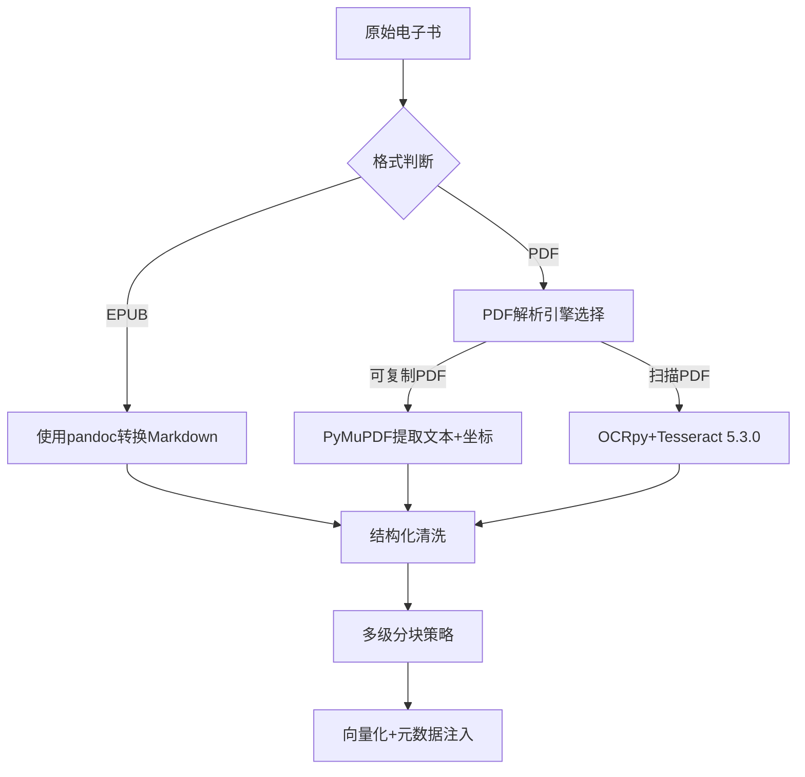
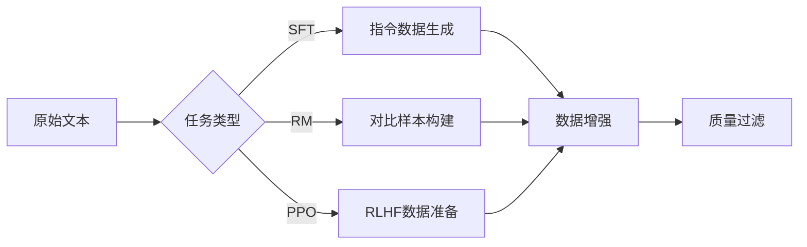
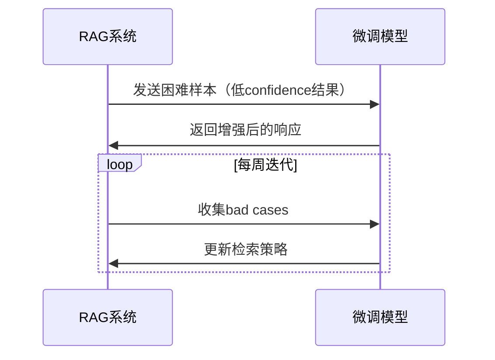

知识库构建

## User

我搜集了一些电子书，想基于这些电子书构建一个知识库用于 RAG，或者处理成样本用于模型训练，请你给我一些建议。 如果打造知识库， 应该如何操作， 电子书的内容要进行怎样的预处理？ 最终的知识库里如何组织和呈现书本里的内容？ 如果是作为训练数据，如何处理能得到更好的结果。 不是训练基座模型，是微调。 本人有比较丰富的开发经验和背景。 请你给出具体的操作建议。

## Agent

好的，用户之前已经询问过关于使用电子书构建知识库和处理训练数据的问题，现在又提出了类似的问题，但这次特别提到要用于RAG和微调，并且强调有丰富的开发经验。我需要先回顾之前的对话，看看是否需要补充或调整建议，特别是针对RAG和微调的具体细节。

首先，用户可能已经了解了一些预处理和存储的基本步骤，但这次需要更具体的技术细节和高级方法。因为用户有开发背景，所以应该提供更深入的实现步骤和工具推荐，避免基础内容。

关于知识库构建，用户提到了RAG，所以需要强调文本分块、向量化、元数据设计以及检索优化。可能需要详细说明不同的分块策略，比如滑动窗口、句子分割，以及如何结合上下文。此外，元数据的设计对于提高检索准确性很重要，比如章节信息、关键词、实体等。

在预处理方面，用户可能需要处理多种格式的电子书，包括扫描版PDF，所以需要更详细的OCR处理建议，比如使用Tesseract的具体参数或替代工具如Adobe API。同时，针对代码和公式的处理，可能需要推荐专门的库，如Latex解析工具。

对于训练数据处理，用户需要微调而不是训练基座模型，所以应重点放在数据清洗、任务适配和数据增强上。可能需要提供更多关于如何生成问答对、摘要的方法，以及如何应用数据增强技术，如同义词替换、回译等。此外，参数高效微调技术（如LoRA）的具体配置示例也会有用。

另外，用户可能关心如何将知识库和训练数据处理结合起来，比如使用RAG的结果来增强微调数据，或者用微调后的模型改进RAG的效果。需要建议两者协同工作的策略，比如迭代优化流程。

还需要考虑版权问题，特别是用户提到有大量电子书，可能需要提醒确保合法使用数据，尤其是在微调时可能涉及的分发问题。

最后，用户可能需要实施路线图，分阶段进行，从验证流程开始，逐步扩展到全量数据，并提供监控和评估方法，比如检索准确率、模型性能指标等。

总结来说，我需要提供结构化的技术方案，涵盖预处理、存储、检索优化、训练数据处理、微调策略，以及两者的协同，同时给出具体的工具、代码示例和实施步骤，适应用户的开发背景，并确保建议的深度和可操作性。


针对有开发经验的用户，我将提供一套完整的工程化方案，涵盖从预处理到部署的全流程。以下分为知识库构建（RAG优化）和训练数据处理（微调优化）两个部分：

---

### 一、知识库构建（RAG专用优化方案）
#### 1. 预处理流水线设计


**关键技术点：**
• **PDF解析优化**：对代码类书籍使用`pdfplumber`的`extract_words()`保留字符坐标，配合`PyMuPDF`的`get_text("blocks")`保持代码缩进
• **OCR增强**：对数学公式使用Tesseract的`--psm 6`模式，配合Mathpix API增强公式识别
• **增量处理**：使用Airflow构建DAG任务流，实现断点续处理

#### 2. 文本分块策略（RAG性能关键）
**分层分块方案：**
```python
from langchain_experimental.text_splitter import SemanticChunker
from langchain.embeddings import HuggingFaceEmbeddings

# 语义分块（适合概念段落）
semantic_splitter = SemanticChunker(
    embeddings=HuggingFaceEmbeddings("BAAI/bge-base-en"),
    breakpoint_threshold_type="percentile",
    breakpoint_threshold=0.8
)

# 代码分块（针对技术书籍）
class CodeSplitter:
    def split(self, text):
        return re.split(r'(?:class |def |\n#{2,})', text) 

# 混合分块流水线
def hybrid_split(text):
    if contains_code(text):
        return code_splitter.split(text)
    else:
        return semantic_splitter.split(text)
```

**元数据设计：**
```json
{
  "chunk_id": "uuid5命名空间",
  "book_meta": {
    "title": "深度学习实战",
    "author": "张三",
    "publish_year": 2023,
    "domain": ["AI", "机器学习"]
  },
  "structural_meta": {
    "chapter": "第三章",
    "section": "3.2 卷积神经网络",
    "page_range": [45, 47],
    "contains": ["code", "equation", "diagram"]
  },
  "semantic_meta": {
    "key_entities": ["CNN", "ReLU", "池化层"],
    "embedding": [0.23, -0.56, ...],
    "knowledge_graph_id": "kg_node_123"
  }
}
```

#### 3. 向量化与索引优化
**多向量混合索引方案：**
```python
# 使用ColBERT实现细粒度索引
from colbert import Indexer
indexer = Indexer(checkpoint="colbert-ir/colbertv2.0")
indexer.index(name="tech_books", collection=chunks)

# 结合传统BM25
from rank_bm25 import BM25Okapi
bm25_index = BM25Okapi(tokenized_docs)

# 混合检索示例
def hybrid_search(query):
    colbert_results = colbert_retriever.search(query, k=50)
    bm25_results = bm25.get_top_n(query, k=50)
    fused_results = reciprocal_rank_fusion(colbert_results, bm25_results)
    return rerank(fused_results)
```

**性能优化技巧：**
• 使用ONNX Runtime加速Embedding计算
• 对超过1M文档采用PQ(Product Quantization)压缩
• 利用GPU Faiss的IVF_PQ索引类型

---

### 二、训练数据处理（微调优化方案）
#### 1. 数据工程架构


#### 2. 指令数据生成（关键步骤）
**技术书籍专用生成策略：**
```python
from langchain.chains import LLMChain
from langchain.prompts import PromptTemplate

prompt = PromptTemplate.from_template("""
作为技术书籍作者，请为以下内容生成多样化的问答对：
要求：
1. 包含至少1个代码相关的问题
2. 包含1个理论推导问题 
3. 使用Markdown格式返回
内容节选：
{text}
""")

chain = LLMChain(llm=Claude3Haiku, prompt=prompt)
result = chain.invoke({"text": book_chunk})
```

**生成数据示例：**
````markdown
## 生成的问答对

**代码实践类**
```python
# 问题：如何在PyTorch中实现带有残差连接的CNN层？
# 参考答案：
class ResidualCNN(nn.Module):
    def __init__(self):
        super().__init__()
        self.conv = nn.Conv2d(64, 64, 3, padding=1)
        
    def forward(self, x):
        return F.relu(x + self.conv(x))
```

**理论推导类**
$$ 
问题：证明卷积操作的交换性：x * w = w * x
证明：
\begin{aligned}
(x * w)[n] &= \sum_{k=-\infty}^{\infty} x[k]w[n-k] \\
&= \sum_{m=-\infty}^{\infty} w[m]x[n-m] \quad (令m = n-k) \\
&= (w * x)[n]
\end{aligned}
$$
````

#### 3. 数据质量管控
**四层过滤机制：**
1. **规则过滤**：使用SQLite的FTS5扩展实现关键词黑名单过滤
2. **模型打分**：用DeBERTa-v3训练二分类器判断生成质量
3. **多样性采样**：基于MinHash的LSH实现语义去重
4. **人工验证**：构建标注平台实现spot check

**代码示例（MinHash去重）：**
```python
from datasketch import MinHashLSH

lsh = MinHashLSH(threshold=0.8, num_perm=128)
for idx, text in enumerate(texts):
    mh = MinHash(num_perm=128)
    for word in jieba.cut(text):
        mh.update(word.encode('utf8'))
    if not lsh.query(mh):
        lsh.insert(idx, mh)
    else:
        print(f"Duplicate: {idx}")
```

---

### 三、协同优化策略
#### RAG与微调的闭环优化


**具体实施：**
1. 在RAG的`retrieve`阶段记录低质量检索（通过`self_query`检测）
2. 使用微调模型对困难样本重新生成
3. 将新数据加入训练集实现主动学习

#### 工程化部署建议
1. **知识库服务**：使用FastAPI构建gRPC接口，配合Ray实现分布式检索
2. **模型服务**：部署Triton Inference Server，使用TensorRT优化推理
3. **监控体系**：
   • 使用Prometheus采集QPS/延迟指标
   • 实现检索质量自动评估（通过BM25+人工标注构建测试集）

---

### 四、实施路线图
1. **验证阶段（1-2周）**
   • 选择3-5本核心书籍搭建MVP
   • 实现基础RAG流程（Chroma+LangChain）
   • 生成1k条SFT样本微调7B模型

2. **扩展阶段（2-4周）**
   • 搭建完整预处理流水线
   • 部署混合检索系统（ES + FAISS）
   • 构建自动化数据增强系统

3. **优化阶段（持续）**
   • 实现闭环反馈系统
   • 引入强化学习优化检索策略
   • 开发领域适配的Embedding模型

**硬件建议：**
• 检索服务：AWS inf2.xlarge (Intel Sapphire Rapids + 100Gbps网络)
• 训练节点：8x A10G（适合QLoRA微调）
• 存储层：Alluxio实现内存级缓存

**关键代码库推荐：**
• 文本处理：Unstructured、Textract
• 向量计算：SentenceTransformers、Jina
• 微调框架：LLaMA-Factory、OpenDelta
• 评估工具：RAGAS、TruLens

建议优先实现验证阶段的核心链路，通过端到端流程验证后再进行工程化扩展。对技术类书籍要特别注意代码片段和数学公式的保留策略，可开发自定义的Markdown解析插件。在微调阶段推荐使用QLoRA+Deepspeed Stage 3的组合优化显存使用。

